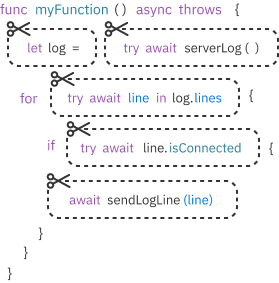
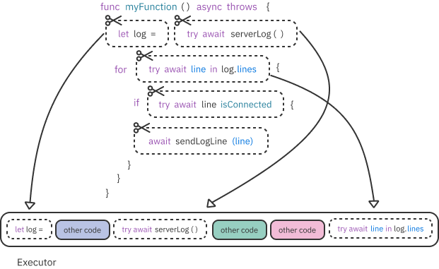
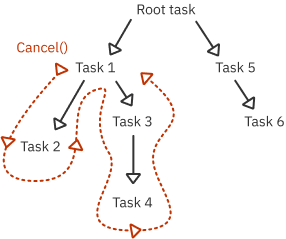
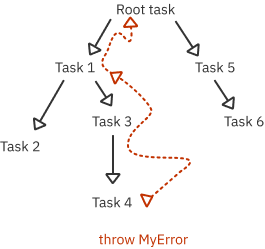
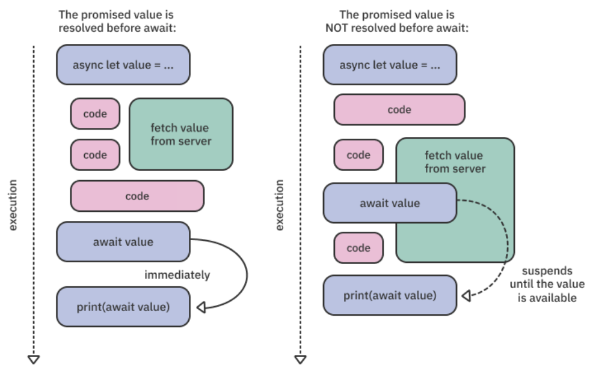
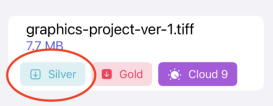
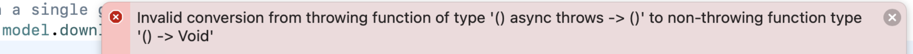
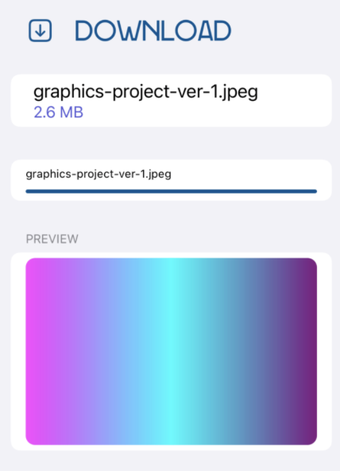

# Getting Started With async/await

이번 챕터에서는 실제 async/await 구문과 이것이 어떻게 비동기 실행을 조정하는지 알아보겠습니다.

추가로 Task type 과 비동기 실행 컨텍스트를 어떻게 생성하는지 알 수 있습니다.

먼저 Swift 5.5 (async/await) 이전의 동시성 프로그래밍에 대해 알아봅시다.

## async/await 이전의 비동기 프로그래밍

```swift
final class API {
  func fetch(completion: @escaping (Data) -> Void) {
    URLSession.shared
      .dataTask(
        with: URL(string: "https://test.com/test")!
      ) { data, response, error in
        completion(data)
      }
      .resume()
  }
}

final class ViewModel {
  let api = API()
  
  var data: Data?
  
  func fetch() {
    api.fetch { [weak self] data in
      self?.data = data
    }
  }
}
```

위 예제는 API 를 호출하는 코드입니다.

이는 간단하지만, 의도를 모호하게 만들며, 여러 에러를 만들어 낼 수 있습니다. 
ex) completion 호출에 대해 검증할 수 없습니다.

Swift 는 Objective-C 를 위해 디자인된 GCD 에 의존했기 때문에, 처음부터 언어 디자인에 비동기성을 통합하기 어려웠습니다.

Objective-C 의 경우 언어가 시작된 수년 후인 iOS 4 에 블록(Swift 의 클로저와 유사함)이 도입되었습니다.

다시 위의 예제를 살펴보겠습니다.

1. 먼저 컴파일러는 `fetch()` 내에서 completion 의 호출횟수를 알 수 있는 방법이 없습니다. 따라서 메모리 사용과 수명을 최적화할 수 없습니다.
2. 해당 코드를 사용할 때 약한참조(weak)를 이용해 메모리를 직접 관리해야 합니다.
3. 컴파일러는 에러를 핸들링했는지 알 수 없습니다. completion 핸들러를 호출하지 않거나 에러를 핸들링하지 않으면 문제가 발생할 수 있습니다.

---

Swift 의 Modern Concurrency Model 은 컴파일러와 런타임 모두와 긴밀하게 동작해 위의 문제를 포함한 많은 문제들을 해결합니다.

Modern Concurrency Model 은 아래의 세가지 도구를 제공합니다.

- async : 메서드 혹은 함수가 비동기임을 나타냅니다. 이를 이용해 비동기 메서드가 결과를 반환할 때까지 실행을 중단할 수 있습니다.
- await : 코드가 async 메서드 혹은 함수가 반환되기 전까지 실행을 중지할 수 있음을 나타냅니다.
- Task : 비동기 작업의 단위입니다. Task 가 완료되기를 기다리거나, 완료되기 전에 취소할 수 있습니다.

위 예제를 Modern Concurrency 를 이용해 다시 작성해보겠습니다.

```swift
final class API {
  func fetch() async throws -> Data {
    let (data, _) = try await URLSession.shared.data(
      from: URL(string: "https://test.com/test")!
    )
    
    return data
  }
}

final class ViewModel {
  let api = API()
  
  var data: Data?
  
  func fetch() {
    Task {
      data = try await api.fetch()
    }
  }
}
```

위 코드는 컴파일러와 런타임에게 더 명확합니다.

- `fetch()` 는 실행을 중단했다 재개할 수 있는 비동기 함수입니다. async 를 사용하여 표시합니다.
- `fetch()` 는 데이터를 반환하거나 에러를 throw 합니다. 컴파일 타임에 확인이 가능해서 오동작을 방지할 수 있습니다.
- Task 는 주어진 클로저를 비동기 컨텍스트에서 실행해서, 컴파일러는 클로저 내에서 쓰기(변경)에 안전한지 알 수 있습니다.
- await 을 사용해 런타임에게 비동기 함수를 호출할 때마다 코드를 중단하거나 취소할 수 있는 기회를 제공합니다. 이는 시스템이 현재 Task queue 의 우선순위를 지속적으로 변경할 수 있게 합니다.

## 코드를 partial tasks 로 분리하기

CPU 코어와 메모리 처럼 공유 자원을 최적화하기 위해, Swift 는 코드를 partial task 혹은 partials 로 불리는 논리 단위로 분리합니다.



Swift 런타임은 비동기 실행을 위해 이 조각들을 각각 스케줄링합니다. 각 partial task 가 완료되면 시스템은 보류된 task의 우선순위와 시스템 부하에 따라 코드를 계속할지 다른 task 를 실행할지 결정합니다.

따라서 await 어노테이션이 붙은 partial task 들은 시스템 재량에 따라 다른 쓰레드에서 실행될 수 있습니다. 또한 await 후에 앱의 상태를 가정해서는 안됩니다. 작성된 코드는 차례대로 나타나지만 실행시간이 많이 차이날 수도 있습니다. task 를 기다리는건 임의의 시간이 걸리며 그 사이에 앱의 상태가 크게 변경될 수 있습니다.

요약하자면 async/await 은 간단하지만 강력한 구문입니다. 이는 컴파일러가 안전하고 견고한 코드를 작성하도록 가이드하고, 런타임이 공유 시스템 자원의 사용을 최적화하도록 합니다.

### partial tasks 실행하기

async, await, let 와 같은 키워드를 사용하는 것은 의도를 명확하게 표현합니다. 동시성 모델의 기반은 비동기 코드를 Executor 에서 실행하는 partial tasks 로 나누는 것을 중심으로 다룹니다. 



Executor 는 GCD queue 와 비슷하지만, 더 강력하고 low-level 입니다. 그리고 Executor 는 작업을 빠르게 실행하고, 실행 순서와 쓰레드 관리 같은 복잡함을 완전히 숨길 수 있습니다.

## Task 의 수명 관리하기

Modern Concurrency 의 중요한 신규 기능 중 하나는 비동기 코드의 수명을 관리하는 시스템의 능력입니다.

기존 멀티 쓰레드 API 의 가장 큰 단점은 비동기 코드가 시작되면 그 코드가 제어를 포기하기 전까지, 시스템이 CPU 코어를 회수할 수 없었다는 점입니다. 이로 인해 특정 작업이 더이상 필요하지 않아도 리소스를 소비하고, 필요하지 않은 작업을 수행합니다.

서버에서 컨텐츠를 가져오는 서비스가 좋은 예제입니다. 서비스를 두 번 호출하면 시스템은 첫번째 호출이 사용한 리소스를 회수할하는 자동 메커니즘이 없어, 불필요한 리소스를 낭비하게 됩니다.

새로운 비동기 모델은 코드를 부분으로 나누어 런타임에서 체크하는 중단 지점을 제공합니다. 
이는 시스템이 코드를 정지시키거나 취소할 수 있는 기회를 줍니다.

덕분에 주어진 작업을 취소할 때 런타임은 비동기 계층으로 이동할 수 있고, 하위 작업을 취소할 수 있습니다.



하지만 중단 지점 없이 긴 계산을 수행하는 작업이 있으면 어떨까요? 이런 경우 Swift 는 현재 작업이 취소되었는지 알 수 있는 API 를 제공합니다. 이 경우 수동으로 실행을 포기할 수 있습니다.

마지막으로 중단 지점은 에러를 위한 탈출 경로를 제공해 코드에서 에러를 캐치하고 핸들링하는 코드로 계층을 끌어올립니다.



새로운 비동기 모델은 잘 알려진 throw 함수 등을 이용해 동기 함수가 가진 구조와 유사하게 에러를 핸들링 할 수 있도록 제공합니다. 또한 task 가 에러를 throw 하는 즉시 메모리를 해제하도록 최적화 되었습니다.

Modern Swift Concurrency Model 에서 반복되는 토픽은 안전함(safety), 최적화된 리소스 사용(optimized resource usage), 최소 구문(minimal syntax) 입니다. 뒤에서는 새로운 API 에 대해 자세히 알아보고 사용해보겠습니다.

## async / await 문법 살펴보기

async 키워드는 함수 바로 다음에 올 수 있습니다.

await 은 호출하려는 함수 앞에 위치하고 throwable (에러를 반환) 하다면 await 앞에 try 를 사용합니다.

```swift
func myFunction() async throws -> String { 
  ... 
}

let myVar = try await myFunction()
```

computed property 에 async 키워드를 작성하는 경우, 아래처럼 사용할 수 있습니다.

```swift
var myProperty: String {
  get async {
    ...
  }
}

print(await myProperty)
```

클로저에 async 를 붙이는 경우

```swift
func myFunction(worker: (Int) async -> Int) -> Int { 
  ... 
}

myFunction {
  return await computeNumbers($0)
}
```

## 서버에서 파일 가져오기

### Server Request 만들기

웹서버에서 JSON 파일을 가져오는 기능을 개발합니다. ([SuperStorageModel.swift](https://github.com/raywenderlich/mcon-materials/blob/editions/1.0/02-beginner-async-await/projects/final/SuperStorage/Model/SuperStorageModel.swift) 파일 참고)

```swift
func availableFiles() async throws -> [DownloadFile] {
  guard let url = URL(string: "http://localhost:8080/files/list") else {
    throw "Could not create the URL."
  }
  
  let (data, response) = try await URLSession.shared.data(from: url)
}
```

URLSession async data 함수를 사용해서 웹서버에서 응답이 오기 전까지 해당 쓰레드에서 다른 작업을 수행할 수 있도록 만들 수 있습니다.

await 은 다음을 의미합니다.

- 현재 코드가 실행을 중단합니다.
- 시스템 부하에 따라 대기중인 메서드는 즉시 또는 나중에 실행됩니다. 더 우선순위가 높은 Task 가 있다면 기다려야할 수 있습니다.
- 메서드 혹은 하위 Task 중 하나가 에러를 발생시키면, 에러는 call hierarchy 를 가장 가까운 catch 문으로 올립니다.

await 을 사용하면 런타임의 central dispatch system 을 통해 모든 비동기 호출을 이동시키는데, 이는 다음과 같습니다.

- 우선순위 지정
- 취소 전파
- 에러 올리기

### 응답 상태 확인하기

- [예제 코드](https://github.com/raywenderlich/mcon-materials/blob/d2916bebbf69895a34a96575a98a1ff3002cd348/02-beginner-async-await/projects/final/SuperStorage/Model/SuperStorageModel.swift#L105)

```swift
guard (response as? HTTPURLResponse)?.statusCode == 200 else {
  throw "The server responded with an error."
}

guard let list = try? JSONDecoder()
  .decode([DownloadFile].self, from: data) else {
  throw "The server response was not recognized."
}
```

비동기 호출이 완료되고 서버 응답을 반환하면, 응답 상태를 확인해 Data 를 디코딩할 수 있습니다.

위 소스코드를 보면 status code 200 을 확인하고, JSONDecoder 를 활용해 [DownloadFile] 로 디코딩하고 있습니다.

### 파일 목록 반환하기

반환은 간단합니다.

메서드의 실행은 비동기적이지만, 코드는 동기적으로 읽을 수 있어 동작을 유추하기 쉽습니다.

```swift
return list
```

### 목록 보여주기

- [예제 코드(ListView.swift)](https://github.com/raywenderlich/mcon-materials/blob/editions/1.0/02-beginner-async-await/projects/starter/SuperStorage/ListView.swift) 에 다음 코드를 추가해봅시다.

```swift
.task {
  guard files.isEmpty else { return }
  
  do {
    files = try await model.availableFiles()
  } catch {
    lastErrorMessage = error.localizedDescription
  }
}
```

파일 목록이 있는지 확인하고, 없다면 `availableFiles()` 를 호출해 가져옵니다.

에러가 발생했다면 lastErrorMessage 에 에러를 할당합니다. 그러면 alert 에서 에러 메시지를 표시합니다.

## 서버의 상태 얻기

서버의 상태를 가져오고, 사용자의 사용 한도를 가져옵니다.

```swift
func status() async throws -> String {
  guard let url = URL(string: "http://localhost:8080/files/status") else {
    throw "Could not create the URL."  
  }
  
  let (data, response) = try await URLSession.shared.data(from: url, delegate: nil)
  
  guard (response as? HTTPURLResponse)?.statusCode == 200 else {
    throw "The server responded with an error."
  }
  
	return String((decoding: data, as: UTF8.self)
}
```

서버 응답이 성공하면 String 을 반환합니다.

이전 예제와 동일하게 데이터를 비동기적으로 가져오고, status code 를 확인합니다.

그 이후 String 으로 디코딩하여 반환합니다.

### 서버 상태 보여주기

ListView.swift 의 task 안에 아래 코드를 추가합니다.

footer 영역에서 status 가 보여지는 것을 확인할 수 있습니다.

```swift
status = try await model.status()
```

## 비동기 호출 그룹화하기

지금까지 ListView.swift 의 task 안에 작성한 코드를 살펴봅시다.

```swift
files = try await model.availableFiles()
status = try await model.status()
```

두 호출은 비동기적이고 이론적으로는 동시에 발생할 수 있습니다.

하지만 await 으로 사용하게 되면 `availableFiles()`에 대한 요청이 완료될 때까지 `status()` 호출이 시작되지 않습니다.


첫번째 호출의 반환값을 두번째 호출의 파라미터로 사용하려는 경우, 위 사진처럼 순차적으로 비동기 함수를 실행해야합니다.

하지만 여기서는 그렇지 않습니다.

서버 상태와 파일 목록은 서로 의존적이지 않기 때문에 두 호출은 동시에 할 수 있습니다.

Swift 는 structured concurrency 의 `async let` 구문을 이용해 이 문제를 해결할 수 있습니다.

### async let 사용하기

Swift 는 여러 비동기 호출을 그룹화해서 한 번에 기다릴 수 있는 구문을 제공합니다.

task 안의 코드를 모두 제거하고, `async let` 구문을 사용해봅시다.

```swift
guard files.isEmpty else { return }

do {
  async let files = try model.availableFiles()
  async let status = try model.status()
} catch {
  lastErrorMessage = error.localizedDescription
}
```

`async let` 바인딩을 사용하면 다른 언어의 promise 개념과 유사한 지역 상수를 만들 수 있습니다.

files, status 바인딩은 특정 타입의 값이나 에러를 나중에 사용가능하다고 약속합니다.

바인딩 결과를 읽으려면 `await` 을 사용해야 합니다. 이미 사용 가능한 값이라면 즉시 받을 수 있고, 그렇지 않다면 결과가 사용가능해질 때까지 일시 중단됩니다.

다음 사진은 값을 즉시 얻어오는 상황과, 중단된 상황에 대한 설명입니다.



### 두 요청에서 값 추출하기

마지막으로 추가한 코드를 보면 `await` 을 호출하기 전에 두 async 코드가 실행됩니다. 따라서 `status()` 와 `availableFiles()` 는 task 안에서 main 코드와 병렬로 실행됩니다.

두 비동기 코드를 그룹화해서 값을 가져오는 방식은 두가지 입니다.

- Collection (e.g Array) 로 그룹화합니다.
- 튜플로 그룹화합니다.

두 문법은 상호 교환 가능합니다. 예제에서는 바인딩이 두 개이므로 튜플을 사용합니다.

```swift
let (filesResult, statusResult) = try await (files, status)
```

## 비동기로 파일 다운로드 하기

[SuperStorageModel.swift](https://github.com/raywenderlich/mcon-materials/blob/editions/1.0/02-beginner-async-await/projects/starter/SuperStorage/Model/SuperStorageModel.swift) 파일의  `download(file:)` 라는 메서드를 살펴봅시다. 

다운로드를 위한 endpoint URL 을 생성하고, 빈 데이터를 반환하고 있습니다.

`SuperStorageModel` 에는 앱 다운로드를 관리하는 두 개의 메서드가 있습니다.

- addDownload(name:) : 진행 중인 다운로드 목록에 파일을 추가합니다.
- updateDownload(name:progress:) : 파일의 progress 를 업데이트합니다.

이 두가지 메서드를 사용해 모델과 UI 를 업데이트합니다.

### 데이터 다운로드

`download(file:)` 에 다음 코드를 추가합니다.

```swift
addDownload(name: file.name)

let (data, response) = try await URLSession.shared.data(from: url, delegate: nil)
  
updateDownload(name: file.name, progress: 1.0)

guard (response as? HTTPURLResponse)?.statusCode == 200 else {
  throw "The server responded with an error."
}

return data
```

`addDownload` 은 모델 클래스의 download 속성에 파일을 추가합니다. DownloadView 는 이를 진행 중인 다운로드 상태를 화면에 표시하는데 사용합니다.

다음 URLSession 을 활용해 데이터를 불러오고, `updateDownload` 를 사용해 진행률을 1.0 으로 업데이트 합니다.

여기서 진행률은 0% 에서 바로 100% 로 업데이트하기 때문에 유용하지 않습니다. 다음 챕터에서 이 기능을 개선할 예정입니다.

### 다운로드 버튼



Silver 버튼에 대한 동작을 구현해야 합니다.

지금까지는 SwiftUI 의 task() 를 활용했습니다. 

비동기 코드를 허용하지 않는 downloadSingleAction 클로저에서는 어떻게 `download(file:)` 을 사용할 수 있을까요?

```swift
fileData = try await model.download(file: file)
```



위 코드를 바로 사용하게 되면 위와 같은 에러가 발생합니다. 

코드는 `() async throws -> Void` 타입이지만, 파라미터는 `() -> Void` 를 동기 클로저 타입을 기대합니다.

실행 가능한 방법 중 하나는 FileDetails 에서 async closure 를 허용하도록 변경하는 것입니다. 

하지만 이 코드에 접근할 수 없다면 어떻게 할 수 있을까요? 다행히 다른 방법이 있습니다.

## non-async 컨텍스트에서 비동기 요청 실행하기

```swift
Task {
  fileData = try await model.download(file: file)
}
```

기존 코드를 위처럼 변경합니다.

여기서 사용한 `Task` 타입은 무엇일까요?

## Task 알아보기

`Task` 는 최상위 비동기 작업을 나타내는 타입입니다. 최상위 수준은 sync context 에서 시작할 수 있는 async context 를 만들 수 있다는 것을 의미합니다.

간단히 말해서, sync context 에서 비동기 코드를 실행하려고 할 때 새로운 Task 가 필요합니다.

다음 API 를 사용해서 작업 실행을 수동으로 제어할 수 있습니다.

- **Task(priority:operation)** : 지정된 우선 순위로 비동기 실행을 위한 작업을 예약합니다. 지정된 우선순위를 nil로 설정하면 현재 sync context 에서 기본값을 상속합니다.
- **Task.detached(priority:operation)** : 호출 context 의 기본값을 상속하지 않는다는 점을 제외하고 Task(priority:operation) 와 유사합니다.
- **Task.value** : 작업이 완료될 때까지 기다리고, 값을 반환합니다. (다른 언어의 Promise 와 유사)
- **Task.isCancelled** : 마지막 중단 지점 이후 작업이 취소된 경우 true 를 반환합니다. 이 값을 통해 예약된 작업의 실행을 중단해야 하는 시점을 알 수 있습니다.
- **Task.checkCancellation()** : 작업이 취소된 경우 CancellationError 를 발생시킵니다.
- **Task.sleep(nanoseconds:)** : 쓰레드를 블락하지 않고 nanoseconds 만큼 기다립니다.

이전 예제에서 `Task(priority:operation:)` 를 사용했습니다. 

기본적으로 Task 는 현재 context 에서 우선 순위를 상속하기 때문에 생략할 수 있습니다.

우선 순위를 변경하려는 경우 priority 를 지정하면 됩니다.

### 다른 Actor 로 부터 새로운 Task 만들기

`Task(priority:operation:)` 를 사용하면 task 를 호출한 actor 에서 실행됩니다.

actor 의 일부가 아닌 동일한 Task 를 생성하려면 `Task.detached(priority:operation:)` 를 사용하면 됩니다.

> 참고 : actor 는 이후 챕터에서 다룰 예정입니다.

지금은 코드가 메인 쓰레드에서 Task 를 생성할 때, 해당 Task 는 메인 쓰레드에서 실행된다고 이해하면 됩니다. 

따라서 앱의 UI 를 안전하게 업데이트할 수 있습니다.

앱을 실행해서 JPEG 파일을 선택하고 Silver plan 버튼을 클릭하면, progress 가 표시되고 이미지의 프리뷰가 표시됩니다.



그러나 progress 가 흔들리고 때때로 중간까지만 채워지는 것을 확인할 수 있습니다.

이를 통해 백그라운드 쓰레드에서 UI 를 업데이트하고 있다는 것을 알 수 있습니다. Xcode 콘솔을 보면 로그 메시지와 함께 보라색 경고를 볼 수 있습니다.

## 메인 쓰레드에서 코드를 동작시키기

`MainActor.run()` 를 사용해 코드를 메인 쓰레드에서 동작시킬 수 있습니다.

`MainActor` 는 메인 쓰레드에서 코드를 실행하는 타입입니다. 이것은 기존에 사용했던 `DispatchQueue.main` 의 대안입니다.

`MainActor.run()` 를 자주 사용하면 코드에 클로저가 많아져 가독성이 떨어집니다.

좀 더 좋은 방법은 `@MainActor` annotation 을 사용하는 것입니다. 이를 사용하면 주어진 함수나 프로퍼티의 호출을 자동으로 메인쓰레드로 전환합니다.

### @MainActor 사용하기

메인 쓰레드에서 UI 변경이 일어나도록 [SuperStorageModel.swift](https://github.com/raywenderlich/mcon-materials/blob/editions/1.0/02-beginner-async-await/projects/starter/SuperStorage/Model/SuperStorageModel.swift) 파일의 다운로드를 업데이트 하는 메서드에 annotation 을 추가합니다.

```swift
@MainActor func addDownload(name: String)

@MainActor func updateDownload(name: String, progress: Double)
```

이 두 메서드에 대한 모든 호출은 메인 액터, 즉 메인 쓰레드에서 자동으로 실행됩니다.

### 비동기로 메서드 실행하기

위 변경으로 컴파일 에러가 발생합니다.

두 메서드를 특정 Actor 에서 실행하려면 비동기적으로 호출해야 합니다.

addDownload, updateDownload 를 사용하는 코드에 await 을 추가하면 에러가 해결됩니다.

```swift
await addDownload(name: file.name)

await updateDownload(name: file.name, progress: 1.0)
```

## 다운로드 화면 업데이트하기

현재까지 작성한 코드에 문제가 있습니다.

파일 목록 화면으로 돌아가서, 다른 파일을 선택하면 다운로드 화면에 이전 다운로드 progress 가 계속 표시됩니다.

`onDisappear()` 에서 모델을 초기화 해서이 문제를 해결할 수 있습니다. [DownloadView.swift](https://github.com/raywenderlich/mcon-materials/blob/editions/1.0/02-beginner-async-await/projects/starter/SuperStorage/DownloadView.swift) 의 toolbar 아래에 코드를 추가해 봅시다.

```swift
.onDisappear {
  fileData = nil
  model.reset()
}
```

---

### 이미지 리소스 출처 및 원문

- https://www.raywenderlich.com/books/modern-concurrency-in-swift/v1.0/chapters/2-getting-started-with-async-await
