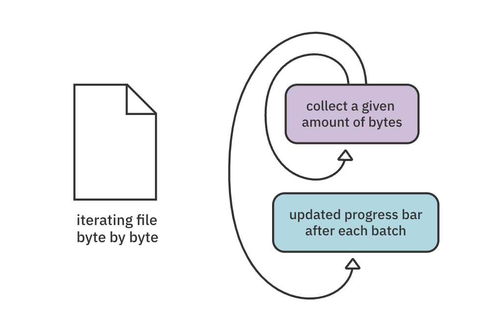
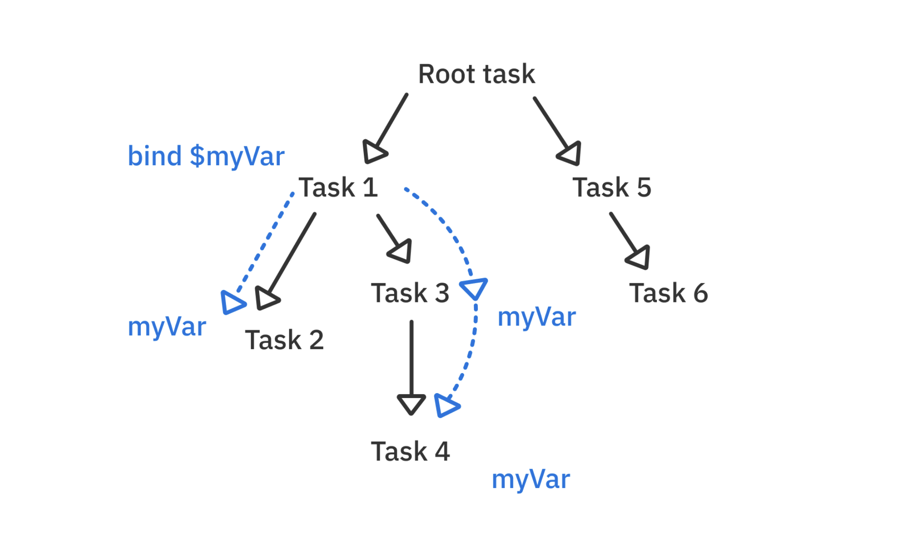
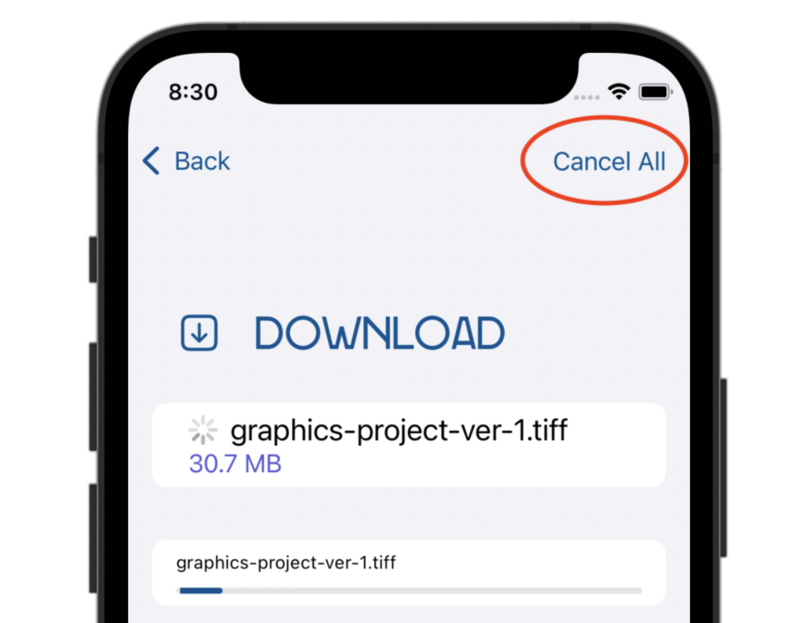
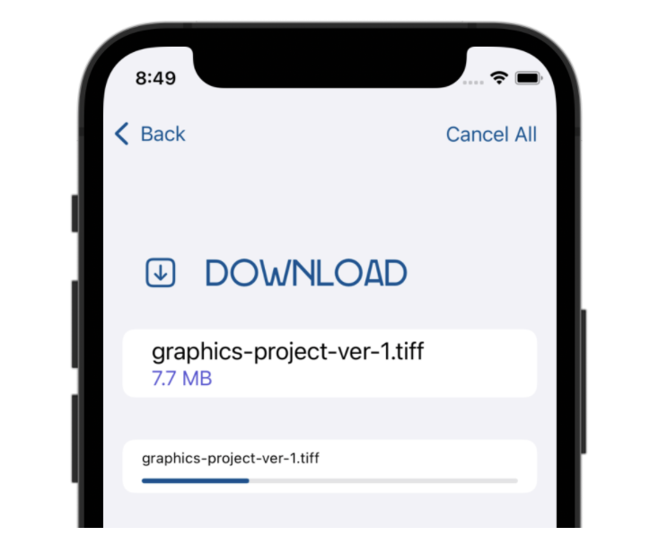
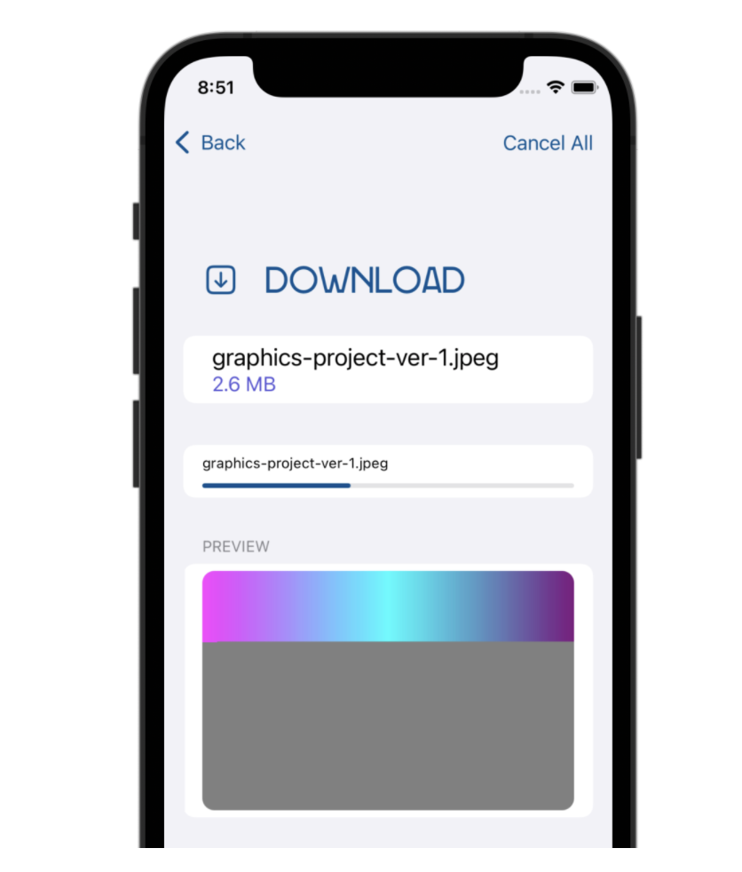
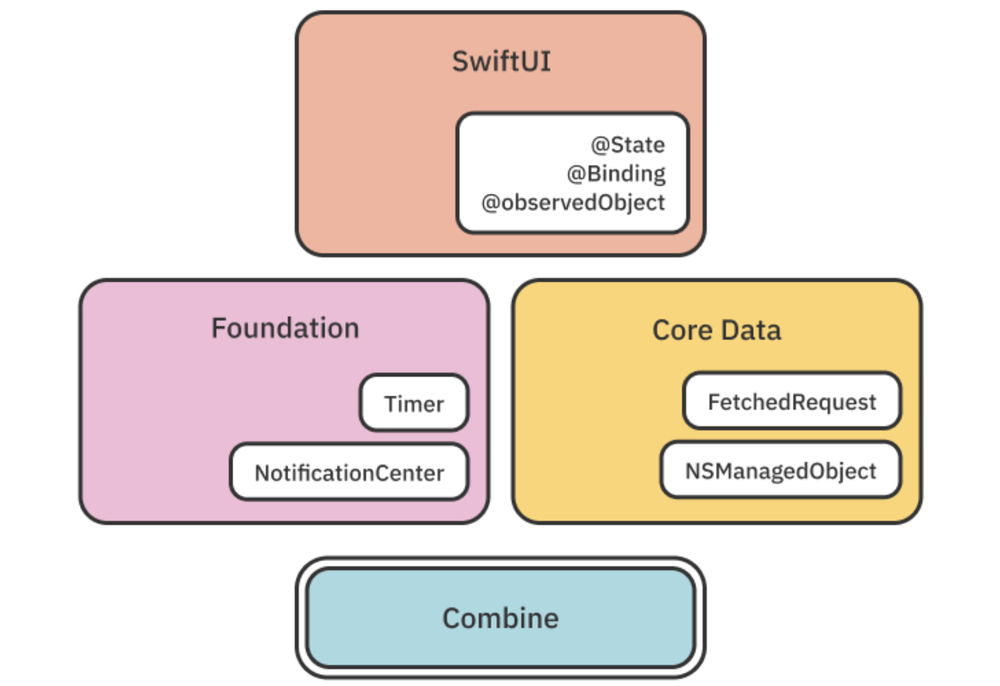
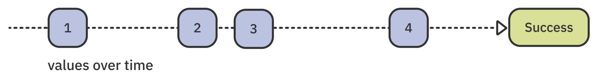
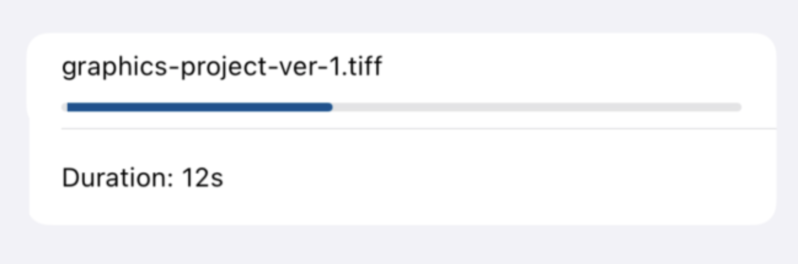

# AsyncSequence & Intermediate Task

## AsyncSequence 알아보기

AsyncSequence 는 Sequence 와 유사하게 비동기 요소를 생성할 수 있는 프로토콜 입니다.

Sequence 와 동일하지만, 다음 요소를 즉시 사용할 수 없기 때문에 기다려야 합니다.

```swift
for try await item in asyncSequence {
  ...
}
```

AsyncSequence 를 사용한 일반적인 코드입니다. await 을 사용해 for 문안의 Sequence 를 반복합니다. (throw 처리가 있는 경우 try 를 사용합니다) 각 루프를 반복할 때 다음 값을 얻기 위해 중단됩니다.

```swift
var iterator = asyncSequence.makeAsyncIterator()

while let item = try await iterator.next() {
  ...
}
```

while 루프 문과도 사용할 수 있습니다. interactor 를 만들고 Sequence 가 끝날 때까지 await 을 사용해 반복적으로 next() 를 호출합니다.

```swift
for await item in asyncSequence
  .dropFirst(5)
  .prefix(10)
  .filter { $0 > 10 }
  .map { "Item: \($0)" } {
    ...
  }
```

표준 Sequence 메서드인 `dropFirst(_:)`, `prefix(_:)`, `filter(_:)` 등을 사용할 수 있습니다.

AsyncSequence 를 따르는 커스텀 Sequence 타입을 만들거나, AsyncStream 을 활용해 기존 코드를 AsyncSequence 로 변경할 수 있습니다.


## AsyncSequence 시작하기

이전 챕터에서는 파일을 한 번에 가져온 뒤 preview 를 보여주는 동작을 구현했습니다.

이번 챕터에서는 파일이 다운로드될 때, 점진적으로 UI 를 업데이트하도록 구현합니다.

파일을 서버에서 byte AsyncSequence 로 읽어 프로그레스바를 업데이트할 수 있습니다.

### Asynchronous sequence 추가하기

[SuperStorageModel.swift](https://github.com/raywenderlich/mcon-materials/blob/editions/1.0/03-async-sequences/projects/starter/SuperStorage/Model/SuperStorageModel.swift) 의 `downloadWithProgress(fileName:name:size:offset:)` 를 확인합니다.

위 코드에는 URL 을 만드는 코드와 `addDownload(name:)` 를 호출해 화면에 다운로드를 추가하는 코드가 작성되어 있습니다.

이 곳에 asynchronous sequence 를 추가하기 앞서 먼저 URLSession 의 API 에 대해 알아봅시다.

```swift
guard let url = URL(string: "test.com") else { return }

let result = try await URLSession.shared.data(from: url)
```

`data(for:delegate:)` 메서드를 사용하면 Data 전체를 불러와 반환합니다.

```swift
guard let url = URL(string: "test.com") else { return }

// let result: (downloadStream: URLSession.AsyncBytes, response: URLResponse)
let result = try await URLSession.shared.bytes(for: urlRequest)
```

반면 `bytes(for:delegate:)` 메서드를 사용하면 `URLSession.AsyncBytes` 를 반환합니다.

`URLSession.AsyncBytes` 는 sequence 로, URL 요청에서 받은 byte 를 비동기적으로 제공합니다.

서버는 HTTP 프로토콜을 통해 부분 요청을 지원할 수 있습니다. 서버가 이를 지원하는 경우, 전체 응답을 한 번에 받지 않고 응답의 바이트 범위를 반환하도록 요청할 수 있습니다. 

앱에서 부분 요청과 일반 요청을 모두 지원하는 예제를 작성해봅시다.

```swift
// SuperStorageModel.swift

guard let url = URL(string: "http://localhost:8080/files/download?\(fileName)") else {
  throw "Could not create the URL."
}

let result: (downloadStream: URLSession.AsyncBytes, response: URLResponse)

if let offset = offset {
  // 부분 요청
  let urlRequest = URLRequest(url: url, offset: offset, length: size)
  
  result = try await URLSession.shared.bytes(for: urlRequest)
  
  guard (result.response as? HTTPURLResponse)?.statusCode == 206 else {
    throw "The server responded with an error."
  }
} else {
  // 전체 요청
  result = try await URLSession.shared.bytes(from: url)
}
```

offset 이 있는 경우 그를 활용해 URLRequest 를 만들어 `URLSession.bytes(for:delegate:)` 에 사용합니다.

그 다음 status code 가 성공적인 부분 응답을 나타내는 206 인지 확인합니다.

부분 요청, 일반 요청 모두 `URLSession.AsyncBytes` 를 사용할 수 있습니다. offset 이 없는 경우 `URLSession.bytes(from:delegate:)` 를 사용합니다.


### ByteAccumulator 사용하기



이제 [ByteAccumulator](https://github.com/raywenderlich/mcon-materials/blob/editions/1.0/03-async-sequences/projects/starter/SuperStorage/Model/ByteAccumulator.swift) 라는 타입을 사용해 sequence 로 부터 batches of byte 를 불러올 수 있습니다.

ByteAccumulator 를 사용하기 위해 [SuperStorageModel.swift](https://github.com/raywenderlich/mcon-materials/blob/editions/1.0/03-async-sequences/projects/starter/SuperStorage/Model/SuperStorageModel.swift) 의 `downloadWithProgress(fileName:name:size:offset:) ` 메서드 return 전에 아래의 코드를 추가합니다.

```swift
// SuperStorageModel.swift

var asyncDownloadIterator = result.downloadStream.makeAsyncIterator()
```

AsyncSequence 는 sequence 에 대해 async iterator를 반환하는 `makeAsyncIterator()` 메서드를 제공합니다.

`asyncDownloadIterator ` 를 활용해 bytes 를 하나씩 반복할 수 있습니다.


이제 모든 바이트를 수집하는 `accumulator` 를 추가합니다.

```swift
// SuperStorageModel.swift

let accumulator = ByteAccumulator(name: name, size: size)

// 1번 루프 : 다운로드가 멈추지 않았는지, accumulator 가 bytes 를 더 수집할 수 있는지
while !stopDownloads, !accumulator.checkCompleted() {
  // 2번 루프 : 배치가 모두 차거나, sequence 가 완료될 때까지
  while !accumulator.isBatchCompleted,
        let byte = try await asyncDownloadIterator.next() {
    accumulator.append(byte)
  }
}
```

**1번 루프**

- 1번 루프를 먼저 살펴보면 2가지의 조건을 가지고 있습니다. 

- 이 두가지 조건을 활용하면 다운로드가 취소되지 않을 때 다운로드가 완료될 때까지 루프문을 유지할 수 있습니다. (취소는 이후에 다뤄보겠습니다.)

  

**2번 루프**

- 2번 루프 또한 2가지의 조건을 가지고 있습니다. 

- accumulator 의 배치가 모두 차거나, sequence 가 완료될 때까지 accumulator 는 bytes 를 수집합니다.


### progress bar 업데이트하기

2번째 while 문 밑에 아래의 코드를 추가해 progress bar 를 업데이트 합니다.

```swift
// SuperStorageModel.swift

let progress = accumulator.progress
Task.detached(priority: .medium) {
  await self.updateDownload(name: name, progress: progress)
}

print(accumulator.description)
```

위 코드에서 낯선 키워드에 대해 살펴보겠습니다.

**Task.detached(...)**

이것은 독자적으로 행동하는 Task 를 만드는 코드입니다.

이로 생성된 Task 는 부모의 priority, task storage, execution actor 를 상속받지 않습니다.

> Task.detached(...) 는 concurrency model 의 효율성에 부정적인 영향을 미쳐 사용하지 않는 것을 권장합니다.

위 예제의 경우 priority 를 medium 으로 할당하여, 다운로드 Task 의 작업 속도가 느려질 가능성은 없습니다.


위의 과정을 통해 완성된 코드는 다음과 같습니다.

```swift
// SuperStorageModel.swift

while !stopDownloads, !accumulator.checkCompleted() {
  while !accumulator.isBatchCompleted,
        let byte = try await asyncDownloadIterator.next() {
    accumulator.append(byte)
  }

  let progress = accumulator.progress
  Task.detached(priority: .medium) {
    await self.updateDownload(name: name, progress: progress)
  }

  print(accumulator.description)
}
```


### 누적 결과 반환하기

`return Data()` 를 아래의 코드로 대체해 결과를 반환합니다.

```swift
// SuperStorageModel.swift

return accumulator.data
```

이제 완성된 메서드는 다운로드 시퀀스를 반복해 모든 데이터를 수집하고, 각 배치가 완료될 때 progress 를 업데이트 합니다.

[DownloadView.swift](https://github.com/raywenderlich/mcon-materials/blob/editions/1.0/03-async-sequences/projects/starter/SuperStorage/DownloadView.swift) 로 이동해 downloadWithUpdatesAction 클로저 파라미터에 아래의 코드를 추가합니다.

```swift
// DownloadView.swift

downloadWithUpdatesAction: {}
  isDownloadActive = true
  Task {
    do {
      fileData = try await model.downloadWithProgress(file: file)
    } catch { }
    isDownloadActive = false
  }
}
```

위 코드는 이전 챕터에서 추가한 downloadSingleAction 와 유사하지만 downloadWithProgress 를 호출한다는 점이 다릅니다.

이제 앱을 실행하고 골드 버튼을 눌러 결과를 확인해봅시다.


## Task 취소하기

Concurrency model 이 효율적으로 작동하기 위해 불필요한 Task 를 취소하는 것은 필수적입니다.

이후에 학습할 TaskGroup 또는 async let 을 사용하면, 시스템이 필요에 따라 Task 를 자동으로 취소할 수 있습니다.

하지만 아래의 Task API 를 사용해 더 세분화된 취소 전략을 구현할 수 있습니다.

- Task.isCancelled
  - task가 취소되었다면 true를 반환합니다
- Task.currentPriority
  - 현재 task 의 우선순위를 반환합니다.
- Task.cancel()
  - task와 그 task의 하위 tasks들도 취소합니다
- Task.checkCancellation()
  - task 가 취소되었다면 CancellationError를 반환합니다
- Task.yield()
  - 현재 작업의 실행을 미루고 시스템에게 우선순위 높은 일을 처리하기 위한 기회를 줍니다.


비동기 코드를 작성할 때 throw 가 필요한지 control flow 를 직접 확인할지에 따라 사용할 API 를 선택할 수 있습니다.


## async task 취소하기

다운로드 중에 뒤로가기 버튼을 눌러도 계속해서 불필요한 다운로드가 진행되는 것을 콘솔에서 확인할 수 있습니다.


## 수동으로 Task 취소하기

지금까지 .taks(...) 안에 비동기 코드를 작성했는데, 이는 뷰가 사라지면 자동으로 코드를 취소해주었습니다.

하지만 이번에 추가한 다운로드 버튼에 대한 동작은 .task() 안에 작성하지 않아서 수동으로 Task 를 취소해야 합니다.

우선 [DownloadView](https://github.com/raywenderlich/mcon-materials/blob/editions/1.0/03-async-sequences/projects/starter/SuperStorage/DownloadView.swift) 에 아래의 프로퍼티를 추가합니다.

```swift
// DownloadView.swift

@State var downloadTask: Task<Void, Error>?
```

downloadTask 에 반환값이 없고 에러가 발생할 수 있는 비동기 Task 을 할당합니다. (Task<Void, Error> 타입)

> Task 는 다른 타입과 동일하게 View, Model 혹은 다른 범위에서 저장할 수 있습니다.


downloadWithUpdatesAction 의 `Task {` 를 아래와 같이 변경합니다.

```swift
// DownloadView.swift

downloadTask = Task {
```

이제 Task 가 downloadTask 에 할당되어 원하는 대로 Task 를 취소할 수 있습니다

사용자가 메인 화면으로 돌아갈 때 취소시키기 위해 onDisappear(...) 의 model.reset() 코드 다음에 아래의 코드를 추가합니다.

```swift
// DownloadView.swift

downloadTask?.cancel()
```

downloadTask 를 취소하면 모든 하위 작업들까지 취소됩니다.

다시 앱을 실행해서 확인해보면, 메인 화면으로 돌아갈 때 콘솔의 로그가 나오지 않는 것을 확인할 수 있습니다.


## Task 에 상태 저장하기

각 비동기 Task 는 priority, actor 등으로 구성된 개별 context 에서 실행됩니다.

이러한 Task 는 다른 Task 를 호출할 수 있습니다.

각 Task 는 여러 함수들과 상호 작용할 수 있기 때문에, 런타임에서 공유 데이터를 격리하는 것은 어려울 수 있습니다.


이를 위해 Swift 는 주어진 속성을 task-local 로 표시하는 `@TaskLocal` property wrapper 를 제공합니다.

SwiftUI 의 environment 에 객체를 주입하는 순간을 생각하면, 그 객체를 해당 View 뿐만 아니라 모든 child views 에서 사용할 수 있도록 합니다.

마찬가지로 TaskLocal 을 바인딩하면 해당 Task 뿐만 아니라 하위 Task 에서도 사용할 수 있습니다.




이제 task-local storage 를 사용해 호출 컨텍스트에 따라 함수의 동작을 변경하는 방법을 배우게 됩니다.

더 구체적으로, 다운로드 화면의 Cancel All 버튼에 대한 동작을 구현합니다.




### partial image preview 추가하기

progressive jpeg 를 사용해 이미지를 부분적으로 디코딩할 수 있습니다.

사용자가 jpeg 이미지를 다운로드하다가 취소한 경우, 부분적으로 다운로드된 미리보기가 표시됩니다.

[SuperStorageModel](https://github.com/raywenderlich/mcon-materials/blob/editions/1.0/03-async-sequences/projects/starter/SuperStorage/Model/SuperStorageModel.swift) 파일을 열고 새 프로퍼티를 추가합니다.

```swift
// SuperStorageModel.swift

@TaskLocal static var supportsPartialDownloads = false
```

사용자가 jpeg 다운로드를 시작하면 supportsPartialDownloads 를 true 로 설정합니다.

그 다음 SuperStorageModel 에 코드를 추가해 플래그 값에 따른 적절한 동작을 제공합니다.

> Task-local 프로퍼티는 static 같은 글로벌 프로퍼티에서 사용 가능합니다.

@TaskLocal property wrapper 는 async task 에 값을 바인딩하거나, task 계층에 주입할 수 있는 withValue() 메서드를 제공합니다.

DownloadView 파일의 downloadWithUpdatesAction 클로저 파라미터의 `fileData = try await model.downloadWithProgress(file: file)` 를 아래의 코드로 변경합니다.

```swift
// DownloadView.swift

downloadWithUpdatesAction: {
  ...
  try await SuperStorageModel
    .$supportsPartialDownloads
    .withValue(file.name.hasSuffix(".jpeg")) {
      fileData = try await model.downloadWithProgress(file: file)
    }
}
```

이처럼 TaskLocal 의 withValue 를 활용해 partialDownload 지원 여부를 바인딩합니다. 

값이 바인딩되면 downloadWithProgress(file:) 을 호출합니다.

이러한 방식으로 아래처럼 여러값을 바인딩할 수 있고, 내부 바인딩 값을 덮어쓸 수 있습니다.

```swift
try await $property1.withValue(myData) {
  ...
  try await $property2.withValue(myConfig1) {
    ...
    try await serverRequest()
    try await $property2.withValue(myConfig2) {
      ...
    }
  }
}
```

너무 많은 값을 바인딩하면 읽고 추론하기 어려울 수 있습니다.

task storage 는 위처럼 단일 값이나 플래그를 분리해서 사용하는 것보다, 데이터 모델을 사용해 적은 값을 바인딩하는 것이 유용합니다.


### Cancel All 기능 추가하기

DownloadView.swift 파일의 .toolbar(...) 코드로 이동해 Cancel All 버튼을 확인합니다.

action 클로저에 아래의 코드를 추가합니다.

```swift
// DownloadView.swift

model.stopDownloads = true
```

이전처럼 onDisappear 에서 다운로드 작업을 취소하는 것이 아니라 stopDownloads 플래그 값을 변경합니다.

다운로드하는 동안 이 플래그 값을 옵저빙하고, true 로 변경되면 Task 를 취소해야한다는 것을 알 수 있습니다.

SuperStorageModel 파일을 열고 downloadWithProgress(fileName:name:size:offset:) 함수의 return 위에 아래의 코드를 추가합니다.

```swift
// SuperStorageModel.swift

if stopDownloads, !Self.supportsPartialDownloads {
  throw CancellationError()
}
```

커스텀한 취소 동작에 대한 동작입니다.

각 다운로드 배치 후에 stopDownloads 값이 true 인지 확인하고, 맞다면 partial preview 를 지원하는지 확인합니다.

- Self.supportsPartialDownloads 가 false 라면 CancellationError 를 던져 다운로드를 즉시 중지합니다.
- Self.supportsPartialDownloads 가 true 라면 부분적으로 다운로드한 파일 콘텐츠를 반환합니다.

다시 앱을 실행해서 동작을 확인해봅시다.




이처럼 progress bar 를 업데이트하지 않고 스피너를 숨기며 다운로드가 중단됩니다.



jpeg 파일의 경우 위의 동작을 포함해 다운로드한 부분의 미리보기를 보여줍니다.


## Combine 과 AsyncSequence 연결하기

애플은 Combine 을 SwiftUI, Foundation, CoreData 등 여러 프레임워크에 통합하였습니다.



Combine 의 Publisher 는 아래처럼 비동기로 값을 전달하고, 선택적으로 success 혹은 failure 이벤트를 통해 완료할 수 있습니다.



애플은 사용자가 작성한 Combine 코드를 사용해 async/await 기능을 사용할 수 있도록 쉬운 인터페이스를 제공합니다.


### progress timer 추가하기

다운로드 시간을 실시간으로 보여주는 타이머를 추가합니다.

isDownloadActive 속성이 true 로 변경될 때마다 비동기 Task 를 만들고, Task 에서 Combine Timer 를 생성해 UI 를 주기적으로 업데이트 하는 것이 목표입니다.

먼저 DownloadView 맨 위에 import 를 추가합니다.

```swift
// DownloadView.swift

import Combine
```

그 다음 DownloadView 에 작업을 취소할 수 있는 Task 속성을 추가합니다.

```swift
// DownloadView.swift

@State var timerTask: Task<Void, Error>?
```

downloadTask 가 변경되면 timerTask 를 취소하고, 조건에 따라 새로운 timerTask 를 생성합니다.

```swift
// DownloadView.swift

@State var downloadTask: Task<Void, Error>? {
  didSet {
    timerTask?.cancel()
    guard isDownloadActive else { return }
    let startTime = Date().timeIntervalSince1970
  }
}
```

startTime 은 이후에 타이머의 시작 시간을 기준으로 duration 을 계산할 때 사용합니다.


### Combine-based timer 생성하기

Combine Timer 를 생성하고 async value 속성을 이용해 사용할 수 있도록 만듭니다.

아래의 코드를 추가해서 startTime 세팅 후 Timer publisher 를 생성합니다.

```swift
// DownloadView.swift

let timerSequence = Timer
  .publish(every: 1, tolerance: 1, on: .main, in: .common)
  .autoconnect()
  .map { date -> String in
    let duration = Int(date.timeIntervalSince1970 - startTime)
    return "\(duration)s"
  }
  .values
```

위 코드를 라인 별로 살펴봅시다.

- Timer.publish : 1초에 한 번씩 이벤트를 보내는 Combine Publisher 를 생성합니다.
- autoconnect : 구독하면 이벤트를 발행합니다.
- map : date 를 계산해 duration 으로 변경합니다.
- values: Publisher 를 AsyncSequence 로 변경합니다. (가장 중요)


Combine Publisher 의 values 속성에 접근하면 await 과 함께 사용할 수 있습니다.

values 는 Publisher 를 AsyncSequence 로 자동 랩핑합니다.

> Combine의 Future 도 value 라는 async value 를 제공합니다.


### 타이머 마무리

마지막으로 timerTask 를 생성하고 시퀀스를 반복합니다.

```swift
// DownloadView.swift

timerTask = Task {
  for await duration in timerSequence {
    self.duration = duration
  }
}
```

다시 앱을 실행해서 타이머 동작을 확인해봅시다.




마지막으로 Cancel All 버튼을 눌러도 타이머가 계속 실행된다는 것을 알 수 있습니다.

Button 의 action 클로저의 다음 코드를 추가합니다.

```swift
// DownloadView.swift

timerTask?.cancel()
```

이제 Cancel All 버튼을 누르면 timerTask 가 취소됩니다.


---

#### 이미지 리소스 출처 및 원문

- https://www.raywenderlich.com/books/modern-concurrency-in-swift/v1.0/chapters/3-asyncsequence-intermediate-task
